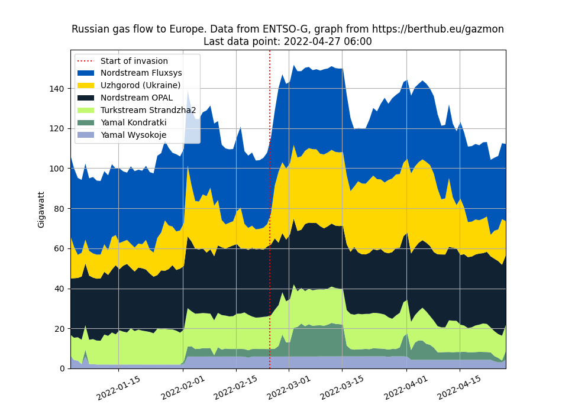

# Plotting natural gas deliveries 

Data is sourced from the "European Network of Transmission System Operators for
Gas", aka [ENTSO-G](https://entsog.eu).

The ENTSO-G service seems to be under quite some load. I recommend that you
use the data files from here so as to not stress out their servers.

In addition, I source data on the EU gas storage levels from
[GIE](https://agsi.gie.eu/#/historical/eu) (Gas Infrastructure Europe). 

Here are the big Russian pipelines I plot right now, with some power numbers
from mid March:

 * Poland, from Belarus
   * 15 GW, Kondratki, [Yamal](https://transparency.entsog.eu/api/v1/operationalData.xlsx?forceDownload=true&pointDirection=by-tso-0001itp-00104exit,pl-tso-0001itp-00104entry&from=2021-11-13&to=2022-03-12&indicator=Physical%20Flow&periodType=hour&timezone=CET&limit=-1&dataset=1&directDownload=true)
   * 6 GW,  Wysokoje,  [?](https://transparency.entsog.eu/#/points/data?points=by-tso-0001itp-00092exit%2Cpl-tso-0002itp-00092entry&zoom=hour)
 * Poland, from Ukraine: 
   * 3.7 GW, Hermanowice, [?](https://transparency.entsog.eu/#/points/data?points=ua-tso-0001itp-10008exit%2Cua-tso-0001itp-10008entry)
 * Germany, direct from Russia:
   * 40 + 30 GW, Greifswald, [Nordstream 1](https://transparency.entsog.eu/#/points/data?points=ru-tso-0002itp-00120exit%2Cde-tso-0018itp-00297entry%2Cde-tso-0016itp-00251entry%2Cde-tso-0005itp-00491entry%2Cde-tso-0001itp-00247entry%2Cde-tso-0015itp-00250entry%2Cde-tso-0001itp-00251entry%2Cde-tso-0020itp-00454entry%2Cde-tso-0017itp-00247entry&zoom=hour)
	Fluxsys / Opal
 * Slovakia, from Ukraine:
   * 35 GW, Uhzgorod, [Transgas](https://transparency.entsog.eu/#/points/data?points=ua-tso-0001itp-00434exit%2Cua-tso-0001itp-00433exit%2Cua-tso-0001itp-00117exit%2Cua-tso-0001itp-00431exit%2Cua-tso-0001itp-00432exit%2Csk-tso-0001itp-00117entry&zoom=hour)

Dutch deliveries:
 * To Germany
   * 6-9GW, [Zevenaar](https://transparency.entsog.eu/#/points/data?points=nl-tso-0001itp-00259exit%2Cde-tso-0009itp-00060entry%2Cde-tso-0002itp-00026entry)
   * 8 GW, [Winterswijk](https://transparency.entsog.eu/#/points/data?points=nl-tso-0001itp-00078exit%2Cde-tso-0009itp-00078entry)

# Direct sources
ENTSO-G is not perfect. Eustream and other TSOs also have their own
statistics if you kow where to look:

 * [Poland/Gaz System](https://swi.gaz-system.pl/swi/public/#!/sgt/renDaily?lang=en)

# To retrieve data yourself
Run `./get-data.sh`, but please don't do so too often!
Requires 'jq' for some preprocessing.

Run `./get-storage.sh` to get EU gas storage levels.

# To regenerate the graphs
Use the provided Jupyter notebook, gazmon.ipynb.

